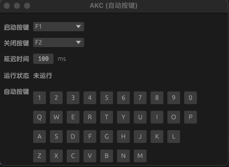
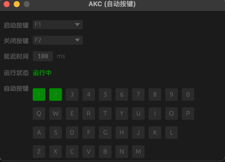

## AKC (自动按键)

### 实现

- `GUI`: [egui](https://github.com/emilk/egui)
- `全局按键`: [livesplit-hotkey](https://github.com/LiveSplit/livesplit-core)
- `键盘模拟输入`: [rdev](https://github.com/Narsil/rdev)

### 界面截图

